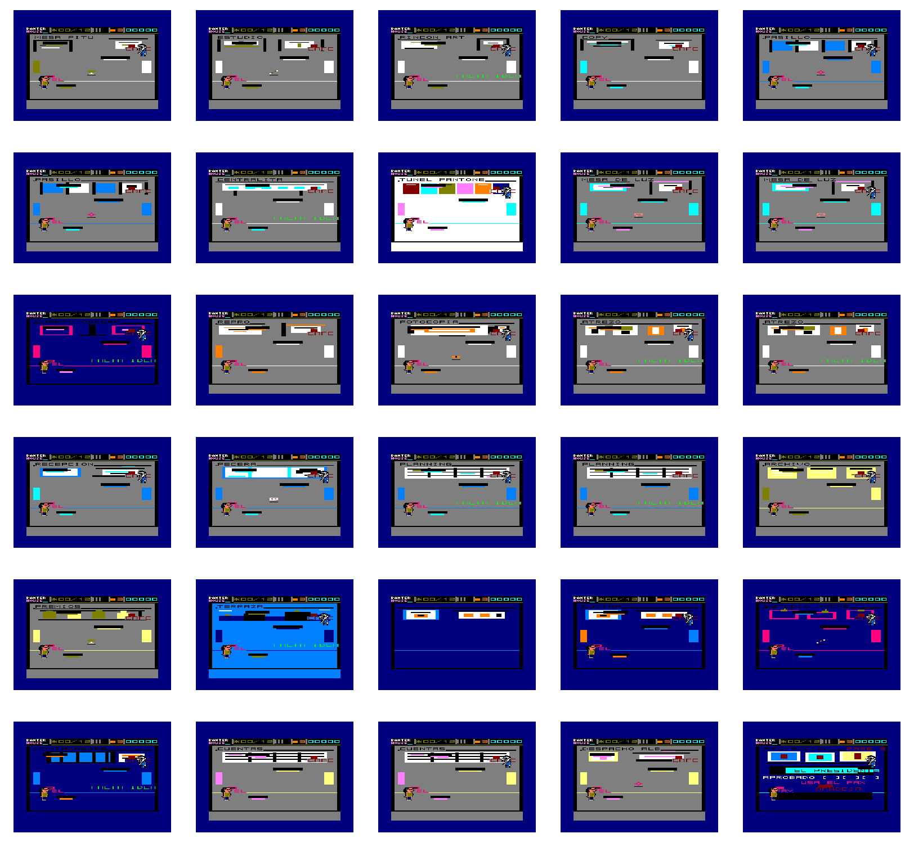

# Banterhouse

**A new Amstrad CPC 6128 game about surviving one impossible night in a Spanish advertising agency.**

[Play in your browser](https://banterhouse-128k.donatoexposito.chatgpt.site/#jugar) ·
[Download the recommended DSK](https://banterhouse-128k.donatoexposito.chatgpt.site/release/banterhouse.dsk) ·
[Read the illustrated manual](https://banterhouse-128k.donatoexposito.chatgpt.site/release/banterhouse-manual.pdf) ·
[Get the complete release pack](https://banterhouse-128k.donatoexposito.chatgpt.site/release/banterhouse-release.zip)



## Welcome to the Casa de la Guasa

Madrid, 03:17. The client has asked for “the same thing, but different.” The
Grand Idea has shattered into twelve pieces and disappeared across the ten
floors of Banterhouse, an agency better known as the **Casa de la Guasa**.

You play **Pitu**, the creative who has to recover concept, copy, art and layout
before the final pitch. Standing in her way is **Alberto Pérez del Briefing
Ramírez de Quiñones**, an account executive whose “one small change” is never
small.

Banterhouse is a fixed-screen exploration, chase and action-puzzle game. Pitu
does not fight. She reads each room, finds cover, creates distractions, uses the
agency’s temperamental machines and turns office chaos against her pursuer.

## What to expect

- A complete ten-floor campaign with **30 individually composed rooms**.
- Twelve pieces of creativity to recover before the final presentation.
- Distinct landmarks, colour palettes and visual jokes in every room.
- Five difficulty settings and a multi-stage final encounter.
- Keyboard, joystick and browser-based touch controls.
- Original packaging, printable artwork and an unofficial retro-magazine feature.

The visual language draws on the rhythm, colour and office-comic energy of
*Creatas y Ejecutas*, while the game structure follows the clarity and economy
of classic Amstrad CPC design. The result is an original playable story, not a
digital reproduction of the comic.

## Play and download

The easiest way to begin is the
[browser edition](https://banterhouse-128k.donatoexposito.chatgpt.site/#jugar),
which mounts the game in a CPC 6128 emulator automatically.

For an emulator or real machine, use the **DSK edition** as the recommended
format. A CDT cassette image is also available from the project site. The full
release pack includes both game formats, a 12-page illustrated user manual,
cover art, cassette and disk inlays, an A4 advertisement and the magazine-style
feature.

### Controls

| Input | Action |
|---|---|
| Arrow keys or QAOP | Move Pitu |
| `S`, Space or joystick fire | Interact / contextual action |
| `Esc` | Pause |

On the title screen, use left/right or `O`/`P` to choose a difficulty and press
`S`, Space or fire to begin.

## Platform

- **Target:** Amstrad CPC 6128 with 128K RAM
- **Display:** Mode 0, 160 × 200, 16 colours
- **Formats:** DSK, CDT and browser emulation
- **Language:** Spanish
- **Typical first playthrough:** approximately 45–70 minutes

## Project status

The software campaign and downloadable packages are complete. Automated
release, campaign, audio, disk-loading and long-run checks are passing, and the
30-room gallery has been captured from the running CPC build. Broader testing
on multiple physical CPC/CRTC combinations and first-time-player sessions
remains useful before making a universal hardware-compatibility claim.

## For contributors

The game source lives in [`src/`](src/), content and artwork in
[`assets/`](assets/) and [`maps/`](maps/), and the public website in
[`site/`](site/). The project uses CPCtelera.

```bash
make release  # clean, validated DSK and CDT build
make qa       # complete automated acceptance suite
```

Start with the following documents when you need more detail:

- [Game design](docs/GAME_DESIGN.md) — story, rules, rooms and campaign flow.
- [Visual system](docs/ROOM_VISUAL_SYSTEM.md) — how the 30 room compositions are produced.
- [Implementation status](docs/IMPLEMENTATION_STATUS.md) — current evidence and remaining external gates.
- [Test plan](docs/TEST_PLAN.md) — automated, emulator and playtest coverage.
- [Technical architecture](docs/DISK_RESOURCE_ARCHITECTURE.md) — memory, disk and resource design.
- [Audio](docs/AUDIO.md) — soundtrack, effects and provenance.
- [Pitu canon](docs/PITU_CANON.md) and [cast guide](docs/CREATAS_CAST.md) — character references.

## Credits and notes

The browser edition uses Salvo Gendut’s
[Javascript 1984](https://github.com/salvogendut/1984) emulator under GPL-2.0.
The resident text font is derived from manuel3d’s
[New Letter Font for AMSTRAD CPC](https://manuel3d.itch.io/letter-font-for-amstrad).
The repository history was imported from
[`fersantxez/bntrhs`](https://github.com/fersantxez/bntrhs).

The Micromanía-style article is an unofficial 2026 editorial recreation and is
not affiliated with the original magazine. The supplied soundtrack source
contains third-party composition metadata; redistribution should be treated as
requiring rights clearance. See [the audio documentation](docs/AUDIO.md) for
the full provenance record.

---

**La Gran Idea no se entrega. Se sobrevive.**
