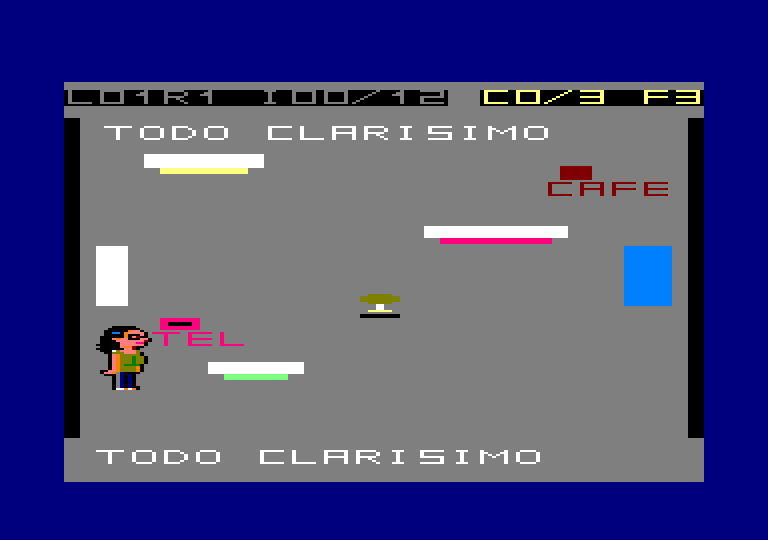
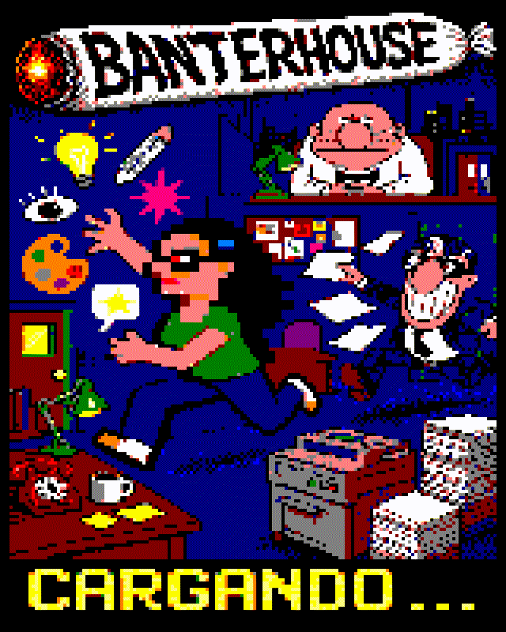

# Banterhouse — plan ambicioso de mejoras

Estado: propuesta de dirección artística, diseño, contenido y producción

Base: estética de *Creatas y Ejecutas*, canon visual existente y arquitectura DSK/128K de Banterhouse

Objetivo: convertir el prototipo funcional en un juego de CPC reconocible por una sola captura, con la cohesión de una tira cómica y el nivel de acabado de los mejores títulos clásicos y modernos de la máquina

## 1. Visión ejecutiva

La dirección correcta no es “hacer más bonito el despacho actual”. Es construir **una tira de oficina jugable**.

Pitu, reproducida con sus píxeles canónicos y su color, se mueve dentro de un mundo de papel claro, tinta negra, viñetas irregulares, grandes cabezas, narices imposibles, silencios incómodos y máquinas de oficina que siempre empeoran la situación. El juego no imita una página concreta de *Creatas y Ejecutas*: adopta su gramática de puesta en escena, timing y sátira para contar situaciones nuevas.

Los referentes de Amstrad CPC aportan otra capa:

- *Get Dexter*: densidad visual, objetos con función, humor integrado y uso inteligente de Mode 0/Mode 1.
- *Head Over Heels* y *Batman*: cada sala como problema legible y estado persistente.
- *La Abadía del Crimen*: personajes que viven fuera de pantalla y arquitectura con carácter.
- *Goody*: España reconocible, objetos cotidianos y humor dentro de una aventura de pantallas.
- *Rick Dangerous II*: identidad fuerte por zona, animación clara y reintento rápido.
- *Prince of Persia*: anticipación, contacto y recuperación expresados mediante animación funcional.
- *Bubble Bobble* y *Pang*: claridad instantánea de pantalla fija y recompensa audiovisual generosa.
- *Le Manoir de Mortevielle*: retratos y diálogo como parte de la presentación, no como texto añadido.
- *R-Type* 128K, *The Shadows of Sergoth* y *Pinball Dreams*: ambición moderna, uso real de disco/RAM expandida y acabado de producto completo.

La meta de v1.0 sigue siendo diez plantas y treinta salas. La ambición se concentra en que esas treinta salas sean memorables, diferentes y terminadas. Un “Director's Cut” con exteriores de Madrid y contenido adicional sólo se abre después del release candidate.

## 2. Diagnóstico del estado actual



El juego actual demuestra movimiento, HUD, audio, campaña y jefe, pero la presentación todavía comunica “harness funcional”:

- Grandes superficies grises sin textura ni composición.
- Muebles representados como rectángulos de color sin identidad material.
- Una sala se distingue de otra por rótulos y posiciones, no por silueta o landmark.
- HUD con información correcta pero poca jerarquía y escasa personalidad.
- Pitu es mucho más específica y expresiva que el mundo que la rodea.
- Alberto funciona como regla, pero todavía no domina visualmente una entrada o persecución.
- Menú, briefing, victoria y derrota parecen pantallas de sistema distintas, no páginas del mismo universo.
- La música y los SFX ya sostienen el juego; falta que cada área tenga voz audiovisual propia.

La portada y la pantalla de carga demuestran una identidad mucho más fuerte:




El trabajo principal consiste en cerrar esa distancia sin perder legibilidad, rendimiento ni canon.

## 3. Principios rectores

1. **Una captura debe bastar.** Sin ver el logo, la pantalla debe reconocerse como Banterhouse.
2. **Una sala es una viñeta.** Tiene encuadre, protagonista visual, acción y remate.
3. **Pitu es la anomalía en color.** El mundo no intenta imitar su construcción; la enmarca.
4. **El humor modifica el juego.** Una fotocopiadora, un fax o un premio no son mero decorado.
5. **El peligro se dibuja antes de actuar.** Entrada, preparación, impacto y recuperación tienen pose, color y sonido.
6. **Pocas cosas, grandes.** Un prop de 32–48 píxeles vale más que diez iconos ilegibles.
7. **El disco cambia contenido, no la respuesta.** Cargar entre viñetas; nunca durante una decisión crítica.
8. **Los trucos de hardware sirven a la idea.** No hay overscan, scroll o raster porque “el CPC puede”.
9. **Todo sigue siendo un juego a 25 Hz.** La belleza que rompe input, audio o lectura no entra.
10. **Canon y derechos son gates.** Pitu no se rediseña; el reparto literal requiere permiso antes de distribución pública.

## 4. Gramática visual de *Creatas y Ejecutas*

El [archivo de Daniel Solana](https://www.flickr.com/photos/danielsolana/albums/72157604028721493/) reúne páginas sobre el día a día de una agencia. La aportación relevante no es copiar dibujos o bocadillos, sino sistematizar las decisiones que les dan identidad.

### 4.1 Papel, tinta y vacío

- Papel blanco o marfil como superficie dominante.
- Negro sólido para pelo, gafas, trajes, maquinaria y golpes de lectura.
- Gris de fotocopia sólo para sombra, profundidad secundaria y elementos inactivos.
- Amplios vacíos alrededor de personajes: la incomodidad necesita aire.
- Trama y rayado manual en piezas grandes, nunca ruido uniforme en todo el fondo.

En CPC, el vacío no es “fondo sin acabar”. Debe estar enmarcado por borde, mobiliario, zócalo, sombra o composición que lo haga deliberado.

### 4.2 Viñetas y repetición

Las tiras explotan paneles estrechos, poses repetidas y cambios mínimos de expresión. Banterhouse lo traduce así:

- Las puertas son cortes entre viñetas.
- La transición conserva un fotograma, desplaza un gutter negro/blanco y revela la sala nueva.
- Un personaje puede asomar nariz, papeles o gafas desde el borde antes de entrar.
- Los briefings y finales usan secuencias de tres paneles: planteamiento, pausa/reacción y remate.
- Algunos gags se resuelven por repetición del mismo fondo con un único tile cambiado.

### 4.3 Caricatura por silueta

- Presidente: cabeza horizontal, nariz central y pajarita; integrado en el fondo.
- Carlitos: tres rizos, ojos/gafas enormes y cuerpo comprimido.
- Art: pelo rayado, gafas ovales, nariz y postura sobre mesa.
- Alberto: casquete corto, gafas negras con relámpagos, nariz enorme, sonrisa dentada y cuerpo mínimo.
- Pitu: melena, gafas, pasador, perfil y ropa permanecen exactamente canónicos.

Los NPC no necesitan caminar. Un retrato grande, una pose de fondo y dos microanimaciones transmiten más identidad con menos RAM.

### 4.4 Timing de comedia

Cada interacción importante sigue uno de estos ritmos:

```text
PLANTEAMIENTO → PAUSA → REMATE
NORMALIDAD → REPETICIÓN → EXCESO
ORDEN → MALENTENDIDO → CONSECUENCIA JUGABLE
```

La pausa puede ser un panel sin texto, una mirada, el ruido de una máquina o medio segundo sin música. No se llena todo con diálogo.

### 4.5 Color puntual y semántico

La paleta base conserva las tintas necesarias para Pitu y asigna roles estables:

| Rol | Color lógico | Uso |
|---|---|---|
| Tinta | Negro | Contorno, traje, peligro sólido |
| Papel | Blanco brillante | Fondo y bocadillos |
| Fotocopia | Blanco/gris medio | Sombra y decorado inactivo |
| Profundidad | Azul oscuro | Suelo, cristal y plano posterior |
| Interacción | Cian | Verbos, cintas, saltos y puertas activas |
| Briefing/peligro | Magenta/rojo | Papeles de Alberto, carga y alerta |
| Creatividad | Amarillo | Piezas, ruta experta y recompensa |
| Transición | Naranja | Ascensor, motor, carga y energía |
| Pitu | Verde, piel y azul canónicos | Nunca se reasignan a otra semántica crítica |

Cada planta recibe uno o dos acentos adicionales, pero no redefine cian, magenta y amarillo. El juego debe seguir funcionando capturado en escala de grises.

## 5. Lo que se adopta de los mejores juegos CPC

| Referente | Patrón que se adopta | Aplicación concreta | Lo que se rechaza |
|---|---|---|---|
| *Get Dexter* | Mode 0 expresivo, objetos útiles, humor y HUD fino | Salas densas pero legibles; experimento Mode 1 sólo para HUD | Isometría e inventario opaco |
| *Head Over Heels* | Sala-puzle y estado persistente | Cada habitación prueba una combinación y recuerda cambios | Cientos de salas y profundidad ambigua |
| *La Abadía del Crimen* | Rutinas fuera de pantalla | Alberto y NPC siguen una lógica espacial predecible | Horario punitivo y obediencia sin explicación |
| *Goody* | Ciudad/objetos españoles con personalidad | Madrid, metro, bar, repro, premios y burocracia | Saltos imprecisos y softlocks |
| *Rick Dangerous II* | Zonas con look, mecánica y clímax propios | Una identidad visual y sonora por planta | Trampas invisibles y aprendizaje por muerte |
| *Prince of Persia* | Animación que informa estados | Poses claras de giro, aviso, impacto, escondite y recuperación | Física compleja y animación ornamental costosa |
| *Bubble Bobble* / *Pang* | Pantalla fija legible y recompensa exuberante | Pickup, sello, café y fin de sala con feedback completo | Densidad alta de enemigos/proyectiles |
| *Le Manoir de Mortevielle* | Retrato, interfaz y conversación cohesionados | Briefings y NPC con close-up y bocadillos | Parser o menú verbal amplio |
| *R-Type* 128K | Presentación completa, modos y secretos | DSK como edición principal, contenido secreto y build pulido | Scroll y espectáculo ajenos al concepto |
| *The Shadows of Sergoth* | 128K/disco para variedad, UI y localización | Packs por planta, retratos, textos y posible ES/EN | Complejidad de RPG e inventario |
| *Pinball Dreams* | Coherencia audiovisual y acabado técnico | Transiciones, música y feedback sincronizados | Interlace, flicker y raster obligatorio |

La selección se apoya en la [lista agregada de mejores juegos de CPCWiki](https://www.cpcwiki.eu/index.php/Top_games), en las notas y fichas de CPC-Power y en `GAMEPLAY_RESEARCH.md`. No se trasladan mapas, sprites, melodías, textos ni composiciones.

## 6. Sistema visual objetivo

### 6.1 Plantilla de sala

La sala jugable sigue siendo 160×184 bajo un HUD de 16 píxeles y una cuadrícula de 20×23 tiles de 8×8.

Cada sala debe contener:

1. Un marco o límite visual que la convierta en viñeta.
2. Un landmark grande de 4×3 a 6×5 tiles.
3. Una ruta principal visible desde cada entrada.
4. Un objeto activo que use el lenguaje cian.
5. Una broma visual dominante.
6. Una zona de reposo con menos tinta.
7. Un plano posterior que no interfiera con colisión.
8. Un detalle reactivo de uno o dos frames.

Familias de tiles:

- `PAPER/INK`: papel, gutters, borde, trama y sombras.
- `ARCH`: paredes, puertas, cristales, suelo y zócalos.
- `OFFICE`: mesas, sillas, archivadores, plantas y tableros.
- `MACHINE`: teléfono, fax, fotocopiadora, proyector y ascensor.
- `SIGN/GAG`: rótulos, premios, layouts, Pantone y chistes visuales.
- `ACTION`: interacción, cobertura, peligro, secreto y transición.

### 6.2 HUD como cabecera editorial

El HUD deja de ser una barra técnica y funciona como cabecera de página:

```text
IDEA 07/12   CARGA ▰▰□   CAFE ×2
```

- Fondo papel y regla negra inferior.
- IDEA como fila de miniaturas del storyboard cuando se pausa.
- CARGA como hojas apiladas, no sólo bloques.
- Café mediante taza/sello, acompañado de número.
- Alertas breves invierten tinta/papel en el borde, nunca toda la pantalla.
- La información crítica siempre combina icono, forma y texto.

**Experimento A0:** comparar HUD completo en Mode 0 con split Mode 1/Mode 0 inspirado en *Get Dexter*. Sólo se adopta el split si funciona en CRTC 0/1/2/4, no altera audio, deja las cuatro tintas necesarias y reduce realmente la carga cognitiva. El fallback all-Mode-0 es producto válido.

### 6.3 Menú, pausa y mapa

- Menú como portada de revista interna: logo, subtítulo y opciones marcadas con lápiz rojo/magenta.
- Selección mediante subrayado nervioso, sello o marca de corrección; no checkbox genérico.
- Pausa como storyboard de tres salas: miniaturas conectadas por gutters, objetivo pendiente y última localización conocida de Alberto.
- Password presentado como referencia de expediente.
- Dificultad expresada con cargos de agencia además de su nombre claro; el nombre funcional siempre permanece.

### 6.4 Bocadillos y retratos

- Máximo dos bocadillos simultáneos y tres líneas cortas por bocadillo.
- Retrato activo de 40–56 píxeles de alto; el resto del personaje puede ser fondo.
- Cola del bocadillo inequívoca y caja de papel opaca.
- Texto nuevo, escrito para el juego; no se transcriben tiras existentes.
- Fuego avanza, dirección acelera y pausa permite releer el último briefing.
- Silencios se representan sin “...”: pose, pausa y sonido ambiente.

### 6.5 Animación económica y expresiva

| Elemento | Frames objetivo | Propósito |
|---|---:|---|
| Pitu andar | 4 por dirección si cabe; mínimo 3 | Cadencia y peso del pelo |
| Pitu giro | 1 transición | Evitar flip instantáneo |
| Pitu esconderse/impacto | 2–3 | Estado inequívoco |
| Alberto andar | 3 por dirección | Cabeza estable, cuerpo apresurado |
| Alberto aviso | 2 | Flash de gafas y papel preparado |
| Alberto recuperación | 2 | Ventana de seguridad visible |
| NPC fondo | 2 | Ojos, mano, lápiz, boca o papel |
| Máquina | 2–4 | Anticipación, acción, reposo |
| Pickup/sello | 3–4 | Celebración breve |

El criterio no es fluidez máxima: cada frame debe comunicar una fase de juego o carácter.

## 7. Mejoras de jugabilidad y puesta en escena

### 7.1 La sala como gag interactivo

Cada sala se documenta con seis campos:

```text
LANDMARK / VERBO / REGLA / GIRO / REMATE / SALIDA SEGURA
```

Ejemplo, Fotocopiadora:

```text
LANDMARK: máquina enorme ocupando un lateral
VERBO: COPIAR
REGLA: el ciclo atrae a Alberto
GIRO: la copia sale cada vez más grande
REMATE: bloquea su propio pasillo
SALIDA SEGURA: rodeo por repro
```

Esto evita salas que sólo cambian decoración y decorados que no aportan juego.

### 7.2 Alberto cruza viñetas, no aparece

- Nariz, gafas, sombra o papeles asoman desde la puerta durante el aviso.
- El sonido direccional precede al sprite.
- Una línea de movimiento o papeles cruzan el gutter cuando cambia de sala.
- Al perder a Pitu, su retrato/papel en el mapa pasa de sólido a última posición conocida.
- Sus estados usan poses diferentes; no se depende sólo de velocidad o color.
- Un briefing fallido puede golpear una máquina y producir un gag útil, nunca daño aleatorio.

### 7.3 NPC como directores de escena

Art, Carlitos y Presidente no son tres nuevas IA. Son nodos que cambian la lectura de una sala:

- Art señala un detalle o altera un layout.
- Carlitos activa, valida o exagera una regla.
- Presidente observa antes de convertirse en objetivo final.
- Sus microanimaciones se disparan por progreso, proximidad o resultado.
- Cada aparición aporta pista, carácter o remate; nunca detiene al jugador para exponer trama innecesaria.

### 7.4 Máquinas como verbos

| Máquina | Verbo | Efecto sistémico | Uso cómico |
|---|---|---|---|
| Teléfono | LLAMAR | Genera ruido remoto | Nadie sabe quién llamó |
| Fax | ENVIAR | Atrae a otra sala | Sigue enviando páginas absurdas |
| Fotocopiadora | COPIAR | Crea cobertura temporal | Escala incorrecta |
| Proyector | PROYECTAR | Alterna paneles/cobertura | Versión equivocada |
| Ascensor | SUBIR | Commit y carga de planta | Espera, música y cartela |
| Máquina de café | RESPIRAR | Reduce Carga una vez | Siempre “último café” |
| Mesa de luz | REVELAR | Muestra ruta/símbolo | Corrección contradictoria |

### 7.5 Feedback de alto valor

| Evento | Visual | Audio | Estado |
|---|---|---|---|
| Creatividad | Amarillo, miniatura vuela al HUD, sello | Arpegio corto | Pieza persistida antes de celebrar |
| Alberto ve a Pitu | Gafas blancas, borde magenta, pose | Motivo direccional | Aviso mínimo garantizado |
| Briefing impacta | Hoja se pega a CARGA, freeze muy breve | Golpe de papel | Sin perder input prolongadamente |
| Escondite válido | Silueta baja y tinta reducida | Ambiente amortiguado | Alberto investiga, no olvida mágicamente |
| Checkpoint | Storyboard completa fila, sello APROBADO | Stinger | Password/progreso confirmado |
| Burnout | Toner negro invade un panel, sello BURNOUT | Stinger y silencio | Reintento rápido |
| Secreto | Marca de registro/garabato aparece | Firma sonora | Bonus, nunca requisito |

### 7.6 Tensión y descanso

No todas las salas contienen persecución. Por planta:

- Una sala enseña o permite observar.
- Una sala combina regla y presión.
- Una sala remata, recompensa o abre un atajo.

El patrón evita fatiga y hace que Alberto parezca más amenazante cuando sí entra.

## 8. Identidad de las diez plantas

| Planta | Gramática visual | Acento | Set piece | Motivo AY |
|---|---|---|---|---|
| 1 — Todo clarísimo | Papel, layouts, mesas abiertas | Amarillo | Primer briefing bloqueado por mesa | Tema base curioso |
| 2 — Una palabra menos | Teléfonos, cables, mamparas | Cian | Cristal muestra a Alberto antes de entrar | Pulsos de llamada |
| 3 — Rojo discreto | Muestras, acetatos, cuarto oscuro | Magenta/cian | Túnel Pantone simbólico | Ostinato cromático |
| 4 — Final bueno | Repro, pilas de papel, máquina gigante | Naranja | Fotocopiadora crea ruta/cobertura | Ritmo mecánico |
| 5 — Reunión previa | Pecera, planning, post-its | Azul/cian | Mamparas cambian con aviso | Bajo contenido |
| 6 — Premio | Trofeos, archivo, terraza | Amarillo/rojo | Galería de premios manipulada | Fanfarria irónica |
| 7 — Para ayer | Papel oscuro, flexos, ventanas | Azul profundo | Apagón por paneles, no pantalla negra | Versión nocturna |
| 8 — El ranking | Cuentas, fax, listados | Verde/magenta | Ranking se reordena al usar fax | Motivo nervioso |
| 9 — Definitiva 12 | Proyector, auditorio, marcas de versión | Blanco/cian | Preview anticipa cambios | Crescendo de pitch |
| 10 — El pitch imposible | Consejo, paneles y sellos | Negro/rojo/amarillo | La composición de viñetas se deforma | Tema del Consejo |

Cada planta comparte estructura para ahorrar disco, pero necesita al menos un set de decorado, un landmark, una máquina/variante y un motivo musical o de instrumentación propios.

## 9. Briefings, escenas y final

### 9.1 Entrada de planta

Una secuencia de 3–5 segundos:

1. Número/nombre como cartela editorial.
2. Tres miniaturas del storyboard de salas.
3. Objetivo y verbo nuevo.
4. Un gesto de personaje o gag.
5. Puertas del ascensor se abren ya sobre gameplay.

El motor del disco puede arrancar durante la cartela; la transferencia ocurre con imagen estática y audio controlado.

### 9.2 Intermedios

- Tres paneles como máximo.
- Un fondo reutilizado y poses/portraits cambiantes.
- Un remate que anticipe la siguiente regla.
- Skip inmediato y opción de releer desde pausa.

### 9.3 Jefe como página que se rebela

El jefe existente gana una puesta en escena exclusiva:

- `MAS GRANDE` agranda físicamente una viñeta y reduce otra mediante parches, no escalado arbitrario.
- `MAS PEQUENO` comprime rutas pero nunca encierra a Pitu.
- Los sellos aparecen estampados sobre la página.
- Alberto rompe un gutter con su briefing en la fase final.
- El Presidente permanece casi inmóvil; ojos, mano y pajarita bastan.

### 9.4 Final y créditos

- Tres viñetas de final existentes con composición y pausas reales.
- Una cuarta página de créditos como expediente de campaña.
- Estadísticas finales convertidas en ficha de agencia.
- Rango, secretos y dificultad visibles.
- Un último teléfono suena después del cierre; se puede dejar sin responder.

## 10. Audio ambicioso pero viable

El audio debe compartir el mismo lenguaje de “tira viva”:

- `La Gran Idea`: menú y portada.
- `La Agencia`: plantas 1–4, con variaciones instrumentales pequeñas.
- `Para ayer`: plantas 5–9, más tensa.
- `Viene Alberto`: motivo corto que puede sustituir una voz, no una segunda canción completa simultánea.
- `El Consejo`: jefe.
- Stingers: pickup, aprobado, burnout, secreto y final.

Leitmotivs:

- Pitu: frase ascendente corta.
- Alberto: dos notas descendentes y papel/ruido.
- Presidente: acorde seco con pausa.
- Máquina: patrones percusivos reutilizables por tempo.

El canal C sigue siendo sacrificable para SFX prioritarios. No se añaden samples. Durante carga DSK, AY se silencia de forma limpia y la transición asume ese silencio; no se simula continuidad que el hardware no puede garantizar todavía.

## 11. Uso de la arquitectura de disco y 128K

Este plan depende de `DISK_RESOURCE_ARCHITECTURE.md`, pero no cambia sus contratos.

| Banco/área | Working set visual propuesto |
|---|---|
| Núcleo bajo | Lógica, renderer, texto, resource manager, player AY |
| RAM4 | Pitu, Alberto, fuente, HUD, tiles/overlays activos |
| RAM5 | Room pack, colisión, decorado y scripts de sala |
| RAM6 | Música y SFX del área |
| RAM7 | Staging, índice y portrait/cutscene temporal |
| `0x8000` | Framebuffer A |
| `0xC000` | Framebuffer B |

Presupuesto de `BHRES.BIN` objetivo, dentro de 100–120 KiB:

| Familia | Objetivo de disco |
|---|---:|
| Kit común de tinta/papel/UI/personajes | 8–12 KiB |
| Diez packs de planta y treinta room maps | 35–45 KiB |
| Retratos y poses de NPC | 10–16 KiB |
| Briefings, final y transiciones | 12–18 KiB |
| Música y SFX | 15–22 KiB |
| Textos, scripts, secretos e índice | 4–7 KiB |
| Reserva | 8–15 KiB |

Gates simultáneos:

- Render RAM4 ≤14 KiB.
- Sala RAM5 ≤14 KiB.
- Audio RAM6 ≤12 KiB.
- Recurso comprimido en staging RAM7 ≤14 KiB.
- Índice RAM7 ≤2 KiB.
- Frame de lógica/render ≤40 ms; objetivo sostenido ≤36 ms.
- Ningún efecto visual añade una entidad de gameplay.

### Trucos de hardware: decisión explícita

| Técnica | Decisión |
|---|---|
| Doble búfer | Sí; ya es parte del motor |
| Paleta distinta por planta | Sí, manteniendo colores semánticos |
| Split Mode 1 HUD / Mode 0 juego | Experimento con fallback |
| Wipe mediante CRTC | Experimento; software wipe es fallback |
| Rasters de paleta | Sólo título/intermedio si es estable |
| Overscan | No: rompe presupuesto y aporta poco a la viñeta |
| Interlace | No: flicker y lectura de texto |
| Scroll continuo | No: la pantalla fija es identidad |
| Sprites hardware CPC+ | No: objetivo CPC 6128 clásico |

## 12. Pipeline de arte y contenido

### 12.1 Biblia visual antes de producción masiva

Debe existir un paquete aprobado con:

- Paleta maestra y variantes por planta.
- Tiles de papel, tinta, bordes, tramas, puerta, cristal y sombra.
- Una mesa, una silla, un archivador y una máquina al nivel final.
- Pitu y Alberto sobre papel claro, zona oscura, cristal y fondo de acento.
- HUD, bocadillo, cartela, sello y mapa.
- Una sala segura, una de persecución y una de diálogo.
- Comparativa a 1×, monitor color, verde y escala de grises.

No se dibujan treinta salas antes de aprobar estas tres.

### 12.2 Ficha de producción por sala

```text
ROOM ID / PLANTA / PALETA / LANDMARK
ENTRADAS / RUTA PRINCIPAL / RUTA EXPERTA
OBJETO ACTIVO / GAG / ESTADO PERSISTENTE
TILES COMUNES / TILES ÚNICOS / ANIMACIÓN
MÚSICA / SFX / CARGA ESTIMADA
TEST DE 5 SEGUNDOS / PEOR FRAME
```

### 12.3 Reglas de economía

- Un landmark nuevo puede reutilizar piezas, pero su silueta no debe confundirse.
- Máximo una animación decorativa activa por sala.
- Variar composición, escala y vacío antes de crear más tiles.
- Los retratos se cargan sólo durante escena y pueden expulsar assets no usados.
- Pantalla completa sólo para carga, final o cutscene; gameplay usa tiles/room packs.
- Todo asset pasa round-trip de conversión, compresión, CRC y presupuesto.

## 13. Roadmap de producción

Las cifras son días-persona orientativos, no calendario contractual.

El núcleo A0–A6 supone **98–155 días-persona**. A7 añade 20–35 días-persona y no forma parte del compromiso de v1.0.

### A0 — Laboratorio de estilo (5–8 días)

Entregables:

- Biblia visual v1.
- Tres mockups CPC reales: menú, sala y briefing.
- Prueba Mode 0 frente a HUD split Mode 1.
- Paleta semántica y test en gris.
- Medición de tamaños tras conversión/compresión.

Aceptación:

- Pitu pasa `PITU_CANON.md` sin cambios.
- Cinco personas identifican objetivo, salida e interacción de la sala en cinco segundos.
- La captura se reconoce como Banterhouse sin logo.
- Se elige una sola plantilla antes de A1.

Rollback: conservar arte actual; ningún cambio de motor depende del experimento gráfico.

### A1 — Sistema visual jugable (8–12 días)

Entregables:

- Kit común PAPER/INK/ARCH/OFFICE/ACTION.
- HUD, menú, pausa/mapa y tipografía final.
- Transición de viñeta y ascensor.
- Feedback de pickup, alerta, impacto, checkpoint y burnout.

Aceptación:

- Mismo lenguaje en menú, gameplay, pausa y derrota.
- 25 Hz sostenidos con Pitu, Alberto, briefing y efecto.
- Ambas páginas de vídeo producen captura equivalente.
- CRTC/hardware gate superado o features experimentales desactivadas.

Rollback: flag `VISUAL_SYSTEM_V2=0`, con HUD/renderer actual todavía compilable.

### A2 — Vertical slice de dos plantas (15–24 días)

Entregables:

- Seis salas definitivas de niveles 1 y 2.
- Pitu y Alberto con estados animados finales.
- Art y Carlitos como directores de escena.
- Briefing inicial, dos motivos de área y transiciones DSK.
- Primera versión del storyboard/mapa.

Aceptación:

- Las seis salas tienen landmark, verbo, gag y salida segura distintos.
- Una persona nueva completa ambas plantas sin explicación oral.
- Alberto nunca aparece sin telegraph visual/sonoro.
- Recursos, RAM, disco y carga cumplen gates.
- El slice se valida en Caprice32 y CPC 6128 real.

Rollback: mantener estos niveles como demo independiente y no escalar contenido.

### A3 — Fábrica de contenido (8–12 días)

Entregables:

- Manifest definitivo y plantillas de room pack.
- Editor/validador de landmarks, rutas, dependencias y working set.
- Preview automático de cada sala a 1× y gris.
- Informe de repetición de tiles, tamaños y peor frame.
- Guía de escritura de bocadillos y gags.

Aceptación:

- Una sala nueva completa entra sin editar código del motor.
- Build rechaza asset, dependencia o working set inválido.
- Mismo input produce el mismo `BHRES.BIN`.

Rollback: producción manual de A2; no comprometer campaña si el pipeline no ahorra tiempo.

### A4 — Campaña completa (35–55 días)

Entregables:

- Plantas 3–9, 21 salas nuevas.
- Paletas, landmarks, máquinas, NPC y variación sonora de cada área.
- Secretos y rutas de maestría.
- Briefings/intermedios estrictamente cortos.

Aceptación:

- Treinta salas distinguibles por captura y navegación.
- Ninguna planta reutiliza la misma combinación de regla y remate.
- Matrix de diez niveles × cinco dificultades completa.
- `BHRES.BIN` mantiene al menos 10 KiB de reserva.

Rollback: congelar una campaña más corta sólo en un hito de planta completo; nunca publicar salas a medio arte.

### A5 — Consejo, final y audio completo (15–24 días)

Entregables:

- Jefe de tres fases con composición de viñetas mutable.
- Presidente, sellos, final y créditos.
- Cinco temas/motivos y stingers finales.
- Estadísticas/rangos de cierre.

Aceptación:

- Cada fase comunica regla y ventana sin texto explicativo durante acción.
- Reintento por fase tarda segundos.
- Cincuenta cambios de escena/audio sin nota colgada ni banco incorrecto.
- Los cinco perfiles completan el jefe de forma determinista.

Rollback: jefe funcional actual con presentación A1; escenas pueden reducirse sin tocar campaña.

### A6 — Pulido de producto (12–20 días)

Entregables:

- Optimización medida, accesibilidad, traducción si cabe y QA real.
- Manual, packaging, hemeroteca y landing alineados con las capturas finales.
- DSK Expanded y Classic; CDT Classic preservado.
- Capturas y vídeo de campaña real, no mockups.

Aceptación:

- Doce playtesters según `TEST_PLAN.md`.
- Campañas completas y soak en hardware.
- Sin softlocks, trampas invisibles, corrupción de bancos ni regresión de audio.
- Derechos/permisos resueltos o sustitución de personajes literales antes de publicación.

Rollback: release Classic/vertical slice; no sacrificar estabilidad por una pieza promocional.

### A7 — Director's Cut opcional (20–35 días)

Sólo se abre tras RC, con disco y producción disponibles:

- Tres exteriores de Madrid: metro, Gran Vía y bar de cierre.
- Gala de premios como planta bonus.
- Dos finales alternativos basados en secretos, no en dificultad.
- Galería de bocetos y jukebox.
- Guardado únicamente si F6 de arquitectura demuestra fiabilidad.

Gate: no reducir la reserva del DSK por debajo de 8 KiB, no romper CDT Classic y no retrasar v1.0.

## 14. Backlog priorizado

### Imprescindible para transformar el juego

| Mejora | Impacto | Esfuerzo | Dependencia |
|---|---:|---:|---|
| Biblia papel/tinta/color puntual | Muy alto | Medio | Ninguna |
| Tres salas vertical-slice definitivas | Muy alto | Alto | Biblia |
| HUD/mapa como storyboard | Alto | Medio | Fuente/tiles |
| Alberto con telegraph visual | Muy alto | Medio | Sprite/canon |
| Feedback completo de cinco eventos | Alto | Medio | Audio/render |
| Transición de viñeta/ascensor | Alto | Medio | Resource loader |
| Room packs por planta | Muy alto | Alto | Arquitectura DSK |
| Test cognitivo y hardware | Muy alto | Medio | Slice |

### Debe entrar en la campaña completa

| Mejora | Impacto | Esfuerzo | Dependencia |
|---|---:|---:|---|
| Retratos y bocadillos | Alto | Alto | Loader/arte canon |
| NPC reactivos de fondo | Alto | Medio | Room scripts |
| Identidad visual/sonora de diez plantas | Muy alto | Muy alto | Pipeline |
| Gags que alteran ruta | Alto | Alto | Diseño por sala |
| Jefe como página mutable | Muy alto | Alto | Parches/loader |
| Final/créditos como expediente | Medio | Medio | Campaña |
| ES/EN desde packs de texto | Medio | Medio | Disco/índice |

### Sólo si no compromete el núcleo

| Mejora | Motivo de cautela |
|---|---|
| HUD multi-mode | Riesgo CRTC/timing por ganancia limitada |
| Lectura entre ticks de audio | PIO FDC y complejidad de sincronía |
| Overlays de código | ABI y banco de staging |
| Guardado en disco | Escritura y corrupción potencial |
| Director's Cut | Producción y capacidad, no motor |

## 15. Métricas de calidad

### Lectura

- En cinco segundos, ≥80 % de testers identifica salida, objetivo visible y objeto interactivo.
- Ninguna información crítica depende sólo de color.
- Pitu y Alberto se distinguen sobre las cuatro familias de fondo.
- Un screenshot de cada sala conserva landmark reconocible a tamaño 1×.

### Juego

- Primer uso de una regla sin daño obligatorio.
- Reintento de sala/fase en menos de cinco segundos sin spin-up nuevo cuando el recurso sigue cacheado.
- Cero entradas de Alberto sin aviso mínimo.
- Cero salas cuya solución dependa de texto externo o muerte previa.

### Producción

- Treinta fichas de sala completas.
- Cero assets fuera de manifest.
- Cero recursos que excedan su working set.
- Reserva DSK ≥10 KiB en v1.0.
- Cada nueva pantalla incluye captura automática color/verde/gris.

### Identidad

- Pitu pasa comparación de máscara/píxel en todos sus frames.
- Cada NPC pasa su hoja de modelo.
- Cada planta tiene landmark, acento y motivo diferenciados.
- El humor se entiende sin copiar frases o composiciones de las tiras originales.

## 16. Riesgos y límites

| Riesgo | Señal temprana | Respuesta |
|---|---|---|
| “Papel blanco” parece vacío | Mockup sin jerarquía a 1× | Añadir marco, masa negra y landmark; no ruido |
| Demasiada tinta oculta colisión | Pitu/puertas se pierden | Reducir trama y reservar negro semántico |
| Pitu parece pegada sobre otro juego | No comparte sombras/escala | Sombras de contacto y props que la enmarquen; no redibujarla |
| Retratos devoran disco | >16 KiB de familia | Menos poses, compartir fondos, ZX7B, cargar uno |
| Gag frena ritmo | Diálogo se repite | Skip, remate visual y texto opcional |
| Trucos CRTC crean variantes | Diferencias entre modelos | Fallback all-Mode-0/software desde A0 |
| Treinta salas pierden calidad | Landmarks repetidos | Congelar por bloques de planta y reducir alcance completo |
| Derechos no confirmados | Sin autorización en alpha | Sustituir reparto literal por equivalentes originales antes de release |
| Arquitectura visual invade núcleo | Código >`0x35FF` | Datos/scripts a disco; no overlay prematuro |

## 17. Decisiones que no deben reabrirse sin evidencia

- Pitu no se rediseña ni se “armoniza” con el trazo de los NPC.
- La cámara sigue siendo plana y de pantallas fijas.
- No se añade combate.
- No se añaden múltiples enemigos complejos.
- No se adopta scroll, overscan, interlace o CPC+ como requisito.
- No se producen más de tres salas finales antes de aprobar la biblia visual.
- No se amplía por encima de diez plantas antes del RC.
- No se escribe al disco de recursos en v1.0.

## 18. Próximo paso recomendado

Ejecutar A0 como un sprint aislado y reversible con tres salidas CPC reales:

1. Rediseño del menú.
2. Rediseño de “Todo clarísimo” con papel/tinta, landmark y máquina.
3. Briefing de tres viñetas con Pitu, Art y entrada anunciada de Alberto.

Cada salida debe existir como PNG fuente, conversión CPC, recurso empaquetado y captura de Caprice32. Al terminar A0 se elige una única dirección mediante legibilidad, canon, tamaño y coste; no mediante preferencia por el mockup más espectacular.

Sólo después de aprobar A0 se incorporan las decisiones aceptadas a `GAME_DESIGN.md` e `IMPLEMENTATION_PLAN.md`. Las variantes rechazadas permanecen como material de laboratorio, no como deuda de producto.

## 19. Fuentes y referencias

Identidad:

- [Archivo original de *Creatas y Ejecutas*](https://www.flickr.com/photos/danielsolana/albums/72157604028721493/).
- [Perfil de Daniel Solana — Club de Creatividad](https://www.clubdecreatividad.com/diascdec/2021-2/daniel-solana/).
- `CREATAS_CAST.md`, `PITU_CANON.md` y las hojas de modelo locales.

Referentes CPC:

- [CPCWiki — Top games](https://www.cpcwiki.eu/index.php/Top_games).
- [Get Dexter — CPC-Power](https://www.cpc-power.com/index.php?num=625&page=detail): Mode 0 + HUD Mode 1, objetos y transiciones CRTC.
- [Head Over Heels — CPC-Power](https://www.cpc-power.com/index.php?num=1066&page=detail).
- [La Abadía del Crimen — CPC-Power](https://www.cpc-power.com/index.php?num=222&page=detail).
- [Goody — CPC-Power](https://www.cpc-power.com/index.php?num=992&page=detail).
- [Rick Dangerous II — CPC-Power](https://www.cpc-power.com/index.php?num=1799&onglet=dsk&page=detail).
- [Prince of Persia — CPC-Power](https://www.cpc-power.com/index.php?num=1684&page=detail).
- [Le Manoir de Mortevielle — CPC-Power](https://www.cpc-power.com/index.php?num=1349&page=detail).
- [R-Type 128K — CPC-Power](https://www.cpc-power.com/index.php?num=7174&page=detail).
- [The Shadows of Sergoth — CPC-Power](https://www.cpc-power.com/index.php?num=14747&onglet=dsk&page=detail).
- [Pinball Dreams — CPC-Power](https://www.cpc-power.com/index.php?num=16736&page=detail).

Documentos de proyecto relacionados:

- `GAME_DESIGN.md`: alcance y reglas canónicas.
- `GAMEPLAY_RESEARCH.md`: patrones de diseño y fuentes históricas.
- `DISK_RESOURCE_ARCHITECTURE.md`: RAM, DSK, loader y recursos.
- `IMPLEMENTATION_PLAN.md`: secuencia de motor/campaña existente.
- `TEST_PLAN.md`: validación funcional, visual y en hardware.
