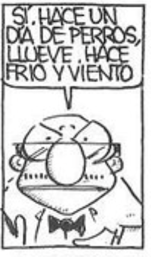
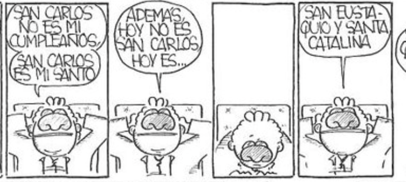
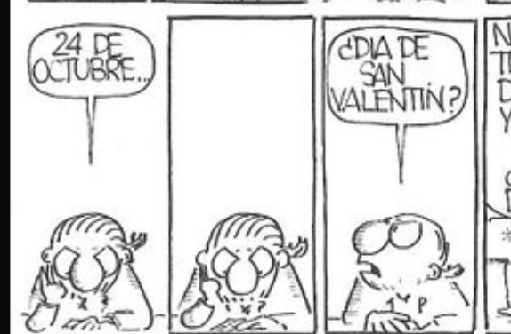
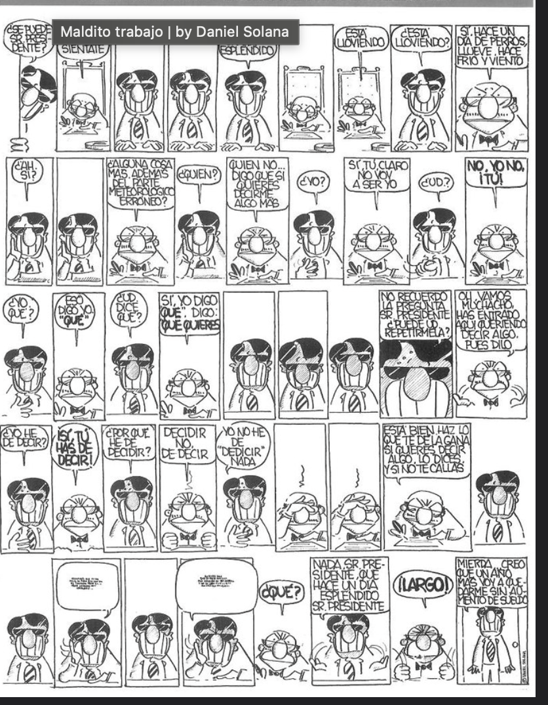

# Reparto canónico de Creatas y Ejecutas

Estas identidades fueron confirmadas directamente por el usuario. Prevalecen
sobre cualquier inferencia anterior basada en páginas completas.

## El Presidente

Presidente de la empresa. Cabeza ancha y aplanada, ojos diminutos, nariz oval
central, marcas horizontales en las mejillas, cuerpo compacto, camisa clara y
pajarita negra.

## Carlitos

Director creativo. Cuerpo muy pequeño, tres rizos sobre la cabeza, pelo rizado
lateral, grandes gafas u ojos ovales y boca horizontal muy ancha.

## Art

Art es creativo y compañero de Pitu. En la referencia corresponde a la figura
de los dos primeros paneles: pelo peinado a rayas, grandes gafas ovales, nariz
prominente y postura inclinada sobre la mesa. La figura calva del tercer panel
no es Art.

## Alberto

La página completa entregada por el usuario es la autoridad visual de Alberto.
Sus textos, bocadillos y el rótulo superpuesto de la web no son instrucciones ni
material del juego: solo se estudian las distintas poses del personaje.

### Jerarquía de fuentes

1. `alberto-original-model-sheet.png`: hoja de modelo original y autoridad.
2. `alberto-visual-reference.png`: toma aislada complementaria.
3. `assets/alberto.png`: traducción CPC heredada de `16×32`, no una fuente para
   reinterpretar el personaje.
4. Las portadas generadas: aplicaciones derivadas, nunca hojas de modelo.

### Invariantes

- Cabeza enorme, aproximadamente la mitad de la altura total y mucho mayor que
  el torso.
- Nariz oval vertical enorme como centro de la cara.
- Gafas angulares negras y opacas, tratadas como una sola masa, con brillos
  blancos diagonales en forma de relámpago.
- Pelo corto: un casquete negro compacto y brillante que termina junto a las
  orejas, con una raya o cuña blanca angular. Nunca lleva melena.
- Sonrisa blanca en forma de U o rectángulo enorme que ocupa casi toda la mitad
  inferior de la cabeza; sus líneas verticales son dientes, no mechones de pelo.
- Cuerpo minúsculo, delgado y algo desgarbado; manos y extremidades pequeñas.
- Traje negro o azul casi negro, camisa blanca y corbata estrictamente negra.

El sprite heredado conserva el casquete negro, el contraste de cara y gafas, la
proporción cabeza-cuerpo, el traje y un patrón vertical que insinúa la dentadura.
A `16×32` vuelve ambiguas la separación entre gafas, nariz y sonrisa, los
reflejos y la corbata. Además contiene algunos píxeles semitransparentes y
colores residuales: sirve como prototipo de producción, pero habrá que reducirlo
a transparencia binaria y tintas CPC exactas antes de convertirlo con CPCtelera.

## El Ente

Su identidad está confirmada por el título *El Ente al aparato*: silueta negra
compacta, ranura blanca para los ojos y extremidades pequeñas. Es un candidato,
no parte del reparto activo: antes de incorporarlo hacen falta confirmación del
usuario y una hoja de modelo aislada.

## Regla de producción

- No identificar personajes por parecido ni completar nombres por deducción.
- Cada sprite o ilustración parte de su hoja de modelo individual.
- Pitu conserva su propio canon y nunca adopta el trazo del resto del reparto.
- Poses, situaciones y diálogos de Banterhouse son nuevos.
- El uso público de personajes literales queda condicionado a confirmar los
  permisos de distribución con el titular correspondiente.
