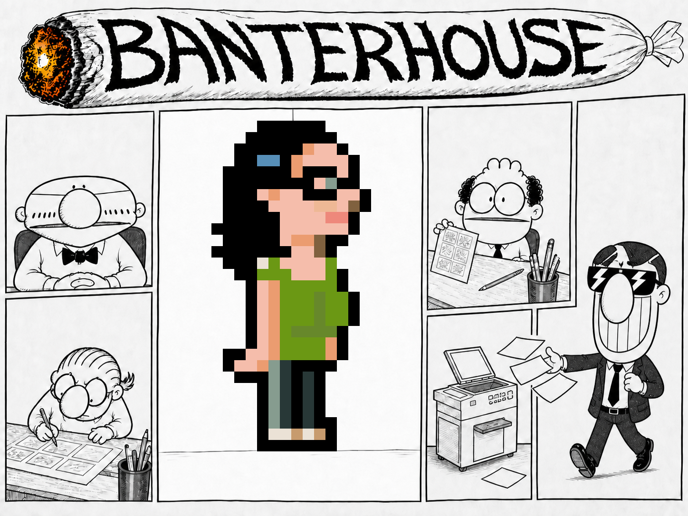

# BANTERHOUSE — El pitch imposible

Documento de diseño canónico para Amstrad CPC 6128 con CPCtelera.

Estado: diseño de producción v8.  
Contenido de la versión 1.0: diez niveles, treinta pantallas y un jefe final.  
Objetivo inmediato: vertical slice de los niveles 1 y 2, seis pantallas.



## 1. La promesa

Pitu debe reconstruir **La Gran Idea** dentro de una agencia de publicidad que
funciona como un laberinto de viñetas. Alberto, el comercial, recorre la misma
agencia intentando entregarle nuevos briefings. En el último piso, Pitu presenta
la campaña al Presidente en un jefe final que convierte sus correcciones en
cambios físicos de la sala.

Es un juego de exploración, persecución y puzle de acción. Pitu no combate:
observa, prepara rutas, usa las máquinas de la agencia y consigue que el propio
caos burocrático trabaje a su favor.

## 2. Género y decisión de cámara

**Laberinto de pantallas fijas con plataformas ligeras contextuales.**

- Vista plana en Modo 0, sin scroll.
- Movimiento libre en cuatro direcciones.
- Puertas en los bordes conectan las pantallas de cada planta.
- Cinta cian señala pequeños saltos o pasos elevados de un solo tile.
- El salto es contextual y determinista: ocho frames, origen y destino válidos.
- No hay gravedad, saltos de precisión, scroll ni cambio de perspectiva.

Esta solución conserva la base cenital actual, admite pasarelas, cables y huecos
sin construir otro motor de físicas y permite que el dibujo canónico de Pitu se
desplace entero. Un plataformas lateral completo solo se reconsiderará después
del vertical slice y nunca formará parte del alcance base.

## 3. Pilares de jugabilidad

1. **Cada pantalla es una micro-situación.** Entrada segura, landmark, ruta
   visible, alternativa arriesgada y salida comprensible.
2. **Alberto es una regla móvil.** Viaja por el grafo; no aparece por azar ni se
   teletransporta.
3. **Pocas reglas, muchas combinaciones.** Cobertura, ruido, recuperación,
   atajos y salto contextual.
4. **Peligro anunciado.** Nada golpea al jugador sin señal visual o sonora.
5. **Tensión y alivio.** Una persecución siempre desemboca en una sala segura,
   una recogida satisfactoria o una broma.
6. **Progreso respetado.** El burnout nunca obliga a repetir piezas recogidas.
7. **Humor jugable.** El gag de cada sala modifica la ruta o la lectura, pero no
   añade un sistema nuevo.
8. **Maestría opcional.** El camino eficiente da puntos y café; nunca bloquea el
   final.

Las lecciones y sus fuentes están separadas en
[`GAMEPLAY_RESEARCH.md`](GAMEPLAY_RESEARCH.md).

## 4. Plataforma objetivo

- Amstrad CPC 6128, 128 KiB; no se promete compatibilidad con CPC 464.
- CPCtelera 1.5-dev del repositorio, fijada en `662fc885`.
- SDCC 4.6 nativo de macOS para desarrollo.
- Caprice32 ARM64 como emulador principal.
- DSK como formato de desarrollo y lanzamiento inicial.
- CDT después del release candidate, sin bloquear el juego.
- Modo 0: 160×200 y 16 tintas elegidas de las 27 físicas.
- HUD: 160×16; área de juego: 160×184.
- Entrada y audio: 50 Hz; simulación y render: 25 Hz.
- Teclado QAOP/cursores y joystick de un botón.

## 5. Controles y tacto

| Entrada | Acción |
|---|---|
| Dirección | Caminar; subir o bajar por la pantalla. |
| Dirección hacia borde abierto | Cambiar de habitación. |
| Fuego junto a icono de acción | Usar máquina, esconderse o abrir atajo. |
| Fuego + dirección sobre cinta cian | Salto contextual de ocho frames. |
| Contacto | Recoger creatividad automáticamente. |
| `Esc` | Pausa, mapa de la planta y piezas pendientes. |

Solo aparece un icono de acción a la vez. La prioridad es: máquina o atajo,
escondite y, por último, salto. No existe un botón contextual cuyo resultado sea
imprevisible.

### Movimiento objetivo

- Velocidad de Pitu: dos píxeles visibles por tick de lógica.
- Si se pulsan dos ejes, se alterna el eje movido para evitar ventaja diagonal.
- Colisión mediante caja interior algo menor que el dibujo.
- Doce ticks de gracia al entrar en una sala.
- Ninguna puerta coloca una entidad sobre otra.
- El salto contextual no concede invulnerabilidad y nunca cruza más de ocho
  píxeles de peligro.

## 6. Objetivo y progreso

La Gran Idea contiene doce piezas:

| Disciplina | Piezas | Lectura visual |
|---|---:|---|
| Concepto | 3 | Bombilla o miniatura de boceto. |
| Copy | 3 | `Aa` o tira de texto. |
| Arte | 3 | Muestra de color o acetato. |
| Maqueta | 3 | Marcas de corte y registro. |

Las piezas usan amarillo, cian y magenta; nunca se confunden con los papeles
blancos de Alberto. Cada cuatro piezas completan una fila del storyboard y
aseguran el progreso de la partida.

Cada planta contiene además tres chispas opcionales. Una se ilumina como ruta
recomendada; seguir las tres en orden da bonus, pero cualquier orden es válido.
Es una capa de puntuación para quien domina el mapa, no otra condición de
victoria.

## 7. Bucle de una planta

1. Se muestra durante dos segundos el nombre, objetivo y croquis de tres salas.
2. Pitu entra en una zona segura y localiza la pieza o piezas pendientes.
3. Lee puertas, muebles, escondites, rutas cian y posición conocida de Alberto.
4. Recoge creatividad o prepara una distracción.
5. El sonido de la recogida puede atraer a Alberto desde otra habitación.
6. Pitu rompe su línea de visión, se esconde fuera de su vista o cambia de sala.
7. Tras obtener el objetivo, vuelve al ascensor o salida señalada.
8. Se contabilizan tiempo, impactos, chispas y café; aparece el código del nivel
   siguiente.

Objetivo de duración: 3–7 minutos por planta la primera vez y 2–4 al dominarla.
Una primera victoria completa debe durar aproximadamente 45–70 minutos; una
repetición eficiente, 25–40.

## 8. Mundo: diez plantas, treinta pantallas

Cada nivel usa tres pantallas conectadas en triángulo `A–B–C–A`. Alguna arista
puede comenzar cerrada, pero al abrirla siempre queda un bucle de escape. El
laberinto surge del grafo y de la geometría interna, no de corredores idénticos.

### Nivel 1 — Todo clarísimo

- **Salas:** Mesa de Pitu, Estudio, Rincón de Art.
- **Objetivo:** Concepto I.
- **Enseña:** movimiento, puertas, recogida y cobertura.
- **Situación:** Art señala el primer fragmento. Alberto aparece tras recogerlo,
  pero su lanzamiento queda bloqueado por una mesa para demostrar línea de tiro.
- **Salida:** ascensor en la Mesa de Pitu.

### Nivel 2 — Una palabra menos

- **Salas:** Copy, Pasillo, Centralita.
- **Objetivo:** Copy I.
- **Enseña:** ruido como señuelo y escondite.
- **Situación:** Carlitos hace sonar un teléfono mientras Alberto se ve detrás
  de un cristal; después el jugador repite la regla.
- **Dificultad:** Alberto olvida a Pitu tras una puerta y conserva aviso largo.

### Nivel 3 — Rojo discreto

- **Salas:** Túnel Pantone, Mesa de luz, Cuarto oscuro.
- **Objetivo:** Arte I.
- **Enseña:** salto contextual y atajo.
- **Situación:** el primer hueco cian está en una sala segura; luego permite
  acortar una persecución. Los colores también llevan símbolos.
- **Gag:** muestras `ROJO DISCRETO` y `AZUL CALIDO`.

### Nivel 4 — Final bueno, ahora sí

- **Salas:** Repro, Fotocopiadora, Almacén de atrezo.
- **Objetivo:** Maqueta I.
- **Enseña:** combinar ruido, cobertura y pasarela.
- **Situación:** la fotocopiadora anuncia su ciclo antes de atraer a Alberto.
- **Checkpoint:** primera fila del storyboard; Carlitos abre el siguiente bloque.

### Nivel 5 — Reunión previa

- **Salas:** Recepción, Pecera, Planning.
- **Objetivo:** Concepto II y Copy II.
- **Gimmick:** tabiques de cristal alternan dos configuraciones de cobertura.
- **Justicia:** el primer cambio ocurre sin Alberto; jamás convierte la posición
  de Pitu en pared ni cierra ambas rutas.
- **Cameo:** el Presidente aparece al fondo de la Pecera.

### Nivel 6 — Premio a nosotros mismos

- **Salas:** Archivo, Pasillo de premios, Terraza.
- **Objetivo:** Arte II.
- **Gimmick:** archivadores densos frente a terraza abierta; pasarela secreta de
  sentido único.
- **Situación:** Art señala un trofeo torcido. Banderines anticipan ráfagas que
  mueven papeles y delatan a Pitu, pero no hacen daño.

### Nivel 7 — Para ayer, de noche

- **Salas:** Cocina, Estudio nocturno, Montacargas.
- **Objetivo:** Maqueta II.
- **Gimmick:** ciclo de luz; en penumbra Alberto ve menos lejos.
- **Justicia:** clic, parpadeo y un segundo de aviso; puertas y Pitu permanecen
  legibles. No se aumenta a la vez la velocidad de Alberto.
- **Checkpoint:** segunda fila del storyboard.

### Nivel 8 — El ranking

- **Salas:** Cuentas, Despacho de Alberto, Fax.
- **Objetivo:** Concepto III y Arte III.
- **Gimmick:** el fax envía ruido a otra pantalla; Alberto estrena un atajo.
- **Justicia:** se le ve usar su puerta privada antes de que pueda sorprender a
  Pitu y nunca emerge sobre ella.
- **Gag:** un ranking manipulado siempre deja a Banterhouse primera.

### Nivel 9 — Definitiva 12

- **Salas:** Sala del cliente, Preproducción, Auditorio.
- **Objetivo:** Copy III y Maqueta III.
- **Gimmick:** paneles de proyector alternan cobertura y líneas de visión.
- **Justicia:** una miniatura anticipa el siguiente estado; la conmutación nunca
  cierra dos salidas. Alberto persiste hasta tres pantallas.
- **Checkpoint:** storyboard completo y acceso al Consejo.

### Nivel 10 — El pitch imposible

- **Salas:** Antesala, Sala del Consejo, Cabina de proyección.
- **Objetivo:** conseguir tres sellos de aprobación del Presidente.
- **Estructura:** antesala segura y jefe de tres fases.
- **Checkpoint:** café, mapa y reinicio por fase antes de entrar.

## 9. Alberto

Alberto es el único perseguidor complejo. Conserva literalmente pelo negro
corto, gafas opacas con reflejos, nariz oval, sonrisa dentada, traje oscuro y
corbata negra. Su canon completo está en [`CREATAS_CAST.md`](CREATAS_CAST.md).

### Estado global fuera de pantalla

- Habitación actual y siguiente.
- Destino de patrulla o fuente de ruido.
- Última habitación donde vio a Pitu.
- Estado: patrulla, investiga, persigue o regresa.
- Temporizador y dirección de entrada.

Las rutas se calculan sobre tres nodos por planta; no hace falta pathfinding
general. Las distancias y puertas cerradas se consultan en el descriptor del
nivel.

### Estado local

`ENTRA → PATRULLA → VE → AVISA → PERSIGUE → APUNTA → PREPARA → LANZA → RECUPERA`

- IA de decisión a 12,5 Hz; movimiento a 25 Hz.
- En Normal, Pitu es un 25 % más rápida; ni siquiera en Muy difícil Alberto
  supera su velocidad sostenida.
- Alberto usa waypoints y enlaces autorizados; no atraviesa muebles.
- Solo dispara con línea horizontal o vertical despejada.
- En Normal, el aviso dura 24 ticks de lógica y la recuperación 55 ticks.
- Límites absolutos de cualquier dificultad: aviso de 18 ticks (0,72 s) y
  recuperación de 40 ticks (1,6 s).
- Solo existe un briefing activo.
- El briefing choca con tiles sólidos.
- No dispara durante el primer segundo tras entrar.
- Al perder a Pitu, visita la última posición y abandona la sala.

## 10. Carga, café y reintento

Cada impacto de briefing añade una hoja de **Carga**.

- En Normal, tres hojas causan **BURNOUT**; el límite depende de la dificultad.
- Se consume un café y Pitu reaparece en la entrada segura de la sala.
- La Carga vuelve a cero y las piezas recogidas permanecen.
- Con cero cafés aparece game over.
- `CONTINUE` reinicia la planta actual, conserva el nivel alcanzado y reinicia
  puntuación de esa planta.
- Cada final de planta muestra un código corto para reanudar desde el menú.
- No se escribe en disco durante la partida.

La Cocina puede retirar una hoja una sola vez por visita. Los cafés secretos son
escasos y nunca se pueden cultivar entrando y saliendo de una sala.

## 11. Interacciones

| Familia | Regla | Ejemplos |
|---|---|---|
| Cobertura | Rompe línea de visión; esconderse requiere no ser visto. | Plantas, armarios, tableros, premios. |
| Ruido | Cambia el destino global de Alberto. | Teléfono, fax, fotocopiadora. |
| Recuperación | Reduce Carga o restituye recurso una sola vez. | Café, fuente de agua. |
| Atajo | Abre una arista o paso de un solo sentido. | Montacargas, archivo, puerta privada. |
| Salto | Cruza un hueco cian ya validado. | Cables, pasarela, bandeja de repro. |

Cada objeto activo parpadea o muestra icono. El resto es decoración estática.

## 12. Jefe final — El Presidente

El Presidente no tiene una barra de vida. La Sala del Consejo muestra tres
casillas `APROBADO [ ][ ][ ]`. Cada fase reutiliza sistemas aprendidos; no se
estrena una física nueva.

### Fase 1 — EL PITCH

Pitu activa Concepto, Copy, Arte y Maqueta en cuatro paneles alrededor de la
mesa. Tras el primer panel entra Alberto con aviso y cooldown largos. El
recorrido presenta toda la arena. Al completar los cuatro paneles se obtiene el
primer sello.

### Fase 2 — CAMBIO MINIMO

El Presidente alterna `MAS GRANDE` y `MAS PEQUENO` en orden fijo. Cada orden
produce un corte de viñeta y aplica una de dos listas de parches de tiles a la
mesa. Las paredes solo cambian durante el corte; nunca sobre Pitu. Hay que llegar
dos veces al control iluminado de la Cabina. Segundo sello.

### Fase 3 — COMO AL PRINCIPIO

El boceto original aparece en la Cabina, pero una montaña de cambios bloquea el
paso. Pitu activa el fax, atrae a Alberto y se coloca para que su único briefing
impacte en la bandeja marcada. El golpe despeja el acceso. Pitu entrega el
boceto al Presidente y obtiene el tercer sello.

### Presupuesto del jefe

- Presidente integrado en tiles de fondo; solo ojos y manos se animan.
- Máximo: Pitu, Alberto, un briefing, un indicador y un efecto.
- Dos configuraciones de sala y pequeñas listas de parches.
- Patrones fijos y avisados; nada aleatorio.
- Burnout reinicia la fase alcanzada, no el jefe completo.
- Tiempo objetivo: 3–5 minutos.

### Final

Tres viñetas estáticas:

1. El Presidente elige el primer boceto original.
2. Alberto declara que siempre fue la estrategia.
3. Llega otra llamada; Pitu, Art, Carlitos y Alberto cierran la puerta y se van.

## 13. Reparto

- **Pitu:** protagonista; su dibujo es inviolable. Reglas en
  [`PITU_CANON.md`](PITU_CANON.md).
- **Alberto:** antagonista sistémico y aliado involuntario en la última fase.
- **Art:** pista visual local, secretos y demostraciones en salas seguras.
- **Carlitos:** valida el storyboard, abre bloques y anticipa cambios de reglas.
- **Presidente:** cameo en nivel 5 y jefe final del nivel 10.

Art, Carlitos y Presidente son tiles o metasprites estáticos con uno o dos
detalles animados. No consumen slots de IA.

## 14. HUD, puntuación y accesibilidad

```text
BANTER  *07/12  |||--  CAFE 3  08450
HOUSE
```

El marcador ocupa los 160×16 píxeles superiores y se divide en cinco módulos:
wordmark completo `BANTER/HOUSE`, progreso `00/12`, hojas de Carga según el
perfil, taza con cafés restantes y score `00000–65535`. Blanco, magenta, cian y
amarillo separan funciones, pero cada valor conserva además forma o cifra. El
score forma parte de la clave de invalidación visual y se actualiza en el mismo
frame lógico que el estado de campaña.

- La cercanía de Alberto usa sonido direccional y un pulso corto de borde.
- Color y forma comunican siempre lo mismo; Pantone no depende solo del color.
- Los textos jugables no superan tres palabras.
- Las tildes se omiten si la fuente CPC no las soporta.
- Pausa muestra tres salas, conexiones, piezas pendientes y posición conocida,
  nunca la posición exacta oculta de Alberto.

Puntuación: tiempo, impactos, cafés, chispas en orden y secretos. Rangos:
`BECARIA`, `JUNIOR`, `CREATIVA`, `DIRECTORA` y `LEYENDA`.

### Dificultad

El menú ofrece cinco perfiles: `MUY FACIL`, `FACIL`, `NORMAL`, `DIFICIL` y
`MUY DIFICIL`. Normal es el valor inicial. Los porcentajes no se calculan en el
Z80: `pasos/8` es una máscara cíclica de ocho decisiones de movimiento.

| Perfil | Pasos de Alberto / 8 | Visión | Aviso | Cooldown | Persiste | Carga | Cafés | Ventana jefe |
|---|---:|---:|---:|---:|---:|---:|---:|---:|
| Muy fácil | 4 | 32 px | 32 ticks | 75 ticks | 0 salas | 5 | 5 | 100 ticks |
| Fácil | 5 | 40 px | 28 ticks | 65 ticks | 1 sala | 4 | 4 | 85 ticks |
| Normal | 6 | 48 px | 24 ticks | 55 ticks | 2 salas | 3 | 3 | 70 ticks |
| Difícil | 7 | 56 px | 20 ticks | 48 ticks | 3 salas | 3 | 2 | 60 ticks |
| Muy difícil | 8 | 64 px | 18 ticks | 40 ticks | 3 salas | 2 | 2 | 50 ticks |

La ventana del jefe es el tiempo durante el que permanece iluminado el control
correcto; los patrones y soluciones no cambian. La ayuda del mapa escala así:

- Muy fácil: habitación exacta de Alberto y ruta sugerida al objetivo.
- Fácil: habitación exacta de Alberto.
- Normal: última habitación conocida.
- Difícil: última habitación conocida durante dos segundos.
- Muy difícil: sin marcador de mapa; permanecen todas las señales sonoras y
  visuales de peligro.

No cambian la geometría, piezas requeridas, velocidad de Pitu, solución de una
sala, número de entidades ni final. Nunca se eliminan señales necesarias por
accesibilidad. Cada tabla de puntuación identifica el perfil, por lo que no hace
falta un multiplicador caro ni comparar resultados incomparables.

La dificultad se elige al empezar, se puede cambiar entre plantas y se puede
bajar desde `BURNOUT`; una petición desde pausa se aplica en la siguiente
transición de sala. El password guarda el perfil. Bajar la dificultad nunca
quita piezas, bloquea contenido ni altera el final.

## 15. Dirección artística

- Pitu conserva todos sus píxeles canónicos y sus colores CPC aprobados.
- Los demás personajes siguen sus hojas de modelo literales.
- Fondo como papel claro y tinta negra con color puntual.
- Una broma visual dominante por pantalla.
- Grandes masas y siluetas; nada que dependa de líneas subpíxel.
- Traje de Alberto negro o azul casi negro y corbata negra.
- Presidente ancho, achatado, ojos mínimos, nariz oval y pajarita negra.

Antes de distribución pública se confirmarán los derechos necesarios para los
personajes literales. Situaciones, poses jugables y diálogos serán nuevos.

## 16. Audio

La música será synth-funk original de comedia y acción ochentera. Las películas
y canciones citadas como ambiente no aportan melodías, riffs, progresiones ni
ritmos copiables.

| Tema | Uso |
|---|---|
| La Gran Idea | Portada y menú. |
| La Agencia | Exploración de niveles 1–4. |
| Para ayer | Exploración de niveles 5–9. |
| Viene Alberto | Capa corta de persecución. |
| El Consejo | Jefe final. |
| Aprobado / Burnout | Stingers de victoria y pérdida. |

- Arkos Tracker 3 para componer y exportar binario.
- Player Arkos incluido con CPCtelera, aproximadamente 2,1 KiB de código.
- Llamada estable a 50 Hz desde el bucle principal.
- Tres canales AY; el canal C se sacrifica para SFX prioritarios.
- Sin samples ni digidrums.

## 17. Presupuesto técnico

### Memoria física

```text
0000–00FF  vectores y scratch protegido
0100–2FFF  motor residente y subconjunto CPCtelera
3000–3BFF  estado, mapa activo, entidades y workspaces
3C00–3FFF  pila, 1 KiB reservado
4000–7FFF  ventana paginable de 16 KiB
8000–BFFF  framebuffer A
C000–FFFF  framebuffer B
```

| Ventana | Contenido | Límite objetivo |
|---|---|---:|
| RAM1 | tiles comunes, Pitu, Alberto, briefing, HUD | 14 KiB |
| RAM4 | 30 mapas ZX7, descriptores, objetos y navegación | 14 KiB |
| RAM5 | música y SFX | 10 KiB |
| RAM6 | portada, final y datos transitorios | 16 KiB |
| RAM7 | jefe, tiles especiales y reserva | 16 KiB |

El ejecutable actual mide 13.614 B, pero casi 10 KiB son gráficos enlazados. Al
sacarlos de `_CODE`, un residente de 11–14 KiB es viable. El código debe salir de
`0x4000–0x7FFF` antes de añadir contenido bancado.

Durante el jefe RAM7 actúa como banco gráfico activo e incluye copias de los
frames necesarios de Pitu, Alberto, briefing y HUD. Esa duplicación evita cambiar
de banco en mitad del render y forma parte del límite de 16 KiB.

### Contenido

- Mapa activo: 20×23 = 460 B.
- Treinta mapas crudos: 13.800 B.
- Objetivo ZX7B: 3–7 KiB para mapas; banco de mundo completo ≤14 KiB.
- Tileset común: 64 tiles × 32 B = 2 KiB.
- Pitu: 3 poses × 2 direcciones × 512 B = 3 KiB enmascarados.
- Alberto: 2 poses × 2 direcciones × 512 B = 2 KiB.
- Briefing, efectos, pickups e iconos: ≤2 KiB.
- Seis a ocho entidades runtime; nunca más de un briefing.

### Rendimiento

- Lógica completa: 25 Hz.
- Audio e input: 50 Hz.
- Peor caso: Pitu, Alberto, briefing, pieza, efecto, música y SFX.
- Frame de lógica y render ≤40 ms; objetivo sostenido ≤36 ms.
- Audio tick ≤2 ms.
- Transición de sala ≤250 ms y presentada como corte de viñeta.
- Pila libre mínima medida: 384 B dentro del bloque reservado.

## 18. Modelo de datos

Cada descriptor usa offsets de banco, no punteros persistentes:

```text
LevelDesc:
  first_room, room_count, start_room, exit_room
  required_mask, rules, music_id, password_seed

RoomDesc:
  map_offset
  north, east, south, west       // FF = sin puerta
  spawn_offset, object_offset, nav_offset, flags

GameState:
  level, room, spawn, difficulty, carga, cafes
  pieces_mask, room_flags, score, alberto_state
```

Al entrar en una sala: paginar RAM4, descomprimir a `map[460]`, cargar spawns y
estado persistente, restaurar RAM1 y dibujar ambos framebuffers. El audio pagina
RAM5 brevemente y siempre restaura RAM1 antes de renderizar.

## 19. Condiciones de terminado

El diseño está realizado cuando:

- Los diez niveles y las treinta pantallas son completables sin guía.
- Los diez niveles son completables y deterministas en los cinco perfiles.
- Las doce piezas y tres checkpoints persisten correctamente.
- Alberto recorre el grafo y nunca aparece de forma injusta.
- El jefe tiene tres fases, reintento por fase y final completo.
- No hay trampas invisibles, softlocks ni saltos de fe.
- Se mantiene 25 Hz en el peor caso y cada banco cabe en 16 KiB.
- Pitu y el reparto pasan su validación canónica.
- Música y arte son originales o cuentan con permiso suficiente.
- DSK arranca en CPC 6128, Caprice32 y al menos una segunda implementación o
  máquina real antes de publicar.
- La matriz automatizada de 50 combinaciones nivel/dificultad y el protocolo de
  playtest local de `TEST_PLAN.md` están completos, con evidencias conservadas.
- Codex ha jugado en Caprice32 cinco campañas completas, una por dificultad,
  desde la portada hasta el final y sin replays ni saltos debug, antes de
  entregar el control al usuario.

El orden de construcción está en
[`IMPLEMENTATION_PLAN.md`](IMPLEMENTATION_PLAN.md) y la verificación completa en
[`TEST_PLAN.md`](TEST_PLAN.md).
